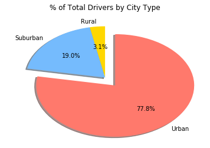

### Analysis

1. Pyber has the more rides, drivers, and fare $$ coming from Urban areas

2. Pyber has the least amount of rides, drivers, and fare $$ coming from Suburban areas

3. Although Urban areas see more rides per city, they also see lower average fare prices. You can see this trend shown within the scatter plot. More information would be needed to see why that is. My first thought would be to look at information about the trip distance. I could see the average fares being lower in an Urban area because people may be travelling shorter distances


```python
#Dependencies
import os
import seaborn as sns
import pandas as pd
import numpy as np
import matplotlib.pyplot as plt
```


```python
#set csv paths
city_csv= os.path.join("Resources","city_data.csv")
ride_csv= os.path.join("Resources","ride_data.csv")
```


```python
#read csvs
city_data = pd.read_csv(city_csv)
print(city_data.head())

ride_data= pd.read_csv(ride_csv)
print(ride_data.head())
```

                 city  driver_count   type
    0      Kelseyland            63  Urban
    1      Nguyenbury             8  Urban
    2    East Douglas            12  Urban
    3   West Dawnfurt            34  Urban
    4  Rodriguezburgh            52  Urban
              city                 date   fare        ride_id
    0     Sarabury  2016-01-16 13:49:27  38.35  5403689035038
    1    South Roy  2016-01-02 18:42:34  17.49  4036272335942
    2  Wiseborough  2016-01-21 17:35:29  44.18  3645042422587
    3  Spencertown  2016-07-31 14:53:22   6.87  2242596575892
    4   Nguyenbury  2016-07-09 04:42:44   6.28  1543057793673
    


```python
group_ride = ride_data.groupby("city")

#find average fare
fare_mean = group_ride.mean()
fare_mean.columns
```


    Index(['fare', 'ride_id'], dtype='object')


```python
#display average fare
fare_mean = fare_mean.drop(["ride_id"],axis=1)
fare_mean=fare_mean.rename(columns={'fare':'Average Fare($) Per City'})
fare_mean.head()

```


<div>
<style>
    .dataframe thead tr:only-child th {
        text-align: right;
    }

    .dataframe thead th {
        text-align: left;
    }

    .dataframe tbody tr th {
        vertical-align: top;
    }
</style>
<table border="1" class="dataframe">
  <thead>
    <tr style="text-align: right;">
      <th></th>
      <th>Average Fare($) Per City</th>
    </tr>
    <tr>
      <th>city</th>
      <th></th>
    </tr>
  </thead>
  <tbody>
    <tr>
      <th>Alvarezhaven</th>
      <td>23.928710</td>
    </tr>
    <tr>
      <th>Alyssaberg</th>
      <td>20.609615</td>
    </tr>
    <tr>
      <th>Anitamouth</th>
      <td>37.315556</td>
    </tr>
    <tr>
      <th>Antoniomouth</th>
      <td>23.625000</td>
    </tr>
    <tr>
      <th>Aprilchester</th>
      <td>21.981579</td>
    </tr>
  </tbody>
</table>
</div>


```python
#calculate total # of rides
ride_sum = group_ride.count()

ride_sum = ride_sum.drop(["ride_id","fare"],axis=1)
ride_sum=ride_sum.rename(columns={"date":"Total Number of Rides Per City"})
ride_sum.head()

```


<div>
<style>
    .dataframe thead tr:only-child th {
        text-align: right;
    }

    .dataframe thead th {
        text-align: left;
    }

    .dataframe tbody tr th {
        vertical-align: top;
    }
</style>
<table border="1" class="dataframe">
  <thead>
    <tr style="text-align: right;">
      <th></th>
      <th>Total Number of Rides Per City</th>
    </tr>
    <tr>
      <th>city</th>
      <th></th>
    </tr>
  </thead>
  <tbody>
    <tr>
      <th>Alvarezhaven</th>
      <td>31</td>
    </tr>
    <tr>
      <th>Alyssaberg</th>
      <td>26</td>
    </tr>
    <tr>
      <th>Anitamouth</th>
      <td>9</td>
    </tr>
    <tr>
      <th>Antoniomouth</th>
      <td>22</td>
    </tr>
    <tr>
      <th>Aprilchester</th>
      <td>19</td>
    </tr>
  </tbody>
</table>
</div>


```python
#calculate total fares (to be used in pie chart later on)
fare_sum = group_ride.sum()

fare_sum = fare_sum.drop(["ride_id"],axis=1)
fare_sum = fare_sum.rename(columns={"fare":"Total Fare"})
fare_sum = fare_sum.reset_index()
fare_sum.head()
```


<div>
<style>
    .dataframe thead tr:only-child th {
        text-align: right;
    }

    .dataframe thead th {
        text-align: left;
    }

    .dataframe tbody tr th {
        vertical-align: top;
    }
</style>
<table border="1" class="dataframe">
  <thead>
    <tr style="text-align: right;">
      <th></th>
      <th>city</th>
      <th>Total Fare</th>
    </tr>
  </thead>
  <tbody>
    <tr>
      <th>0</th>
      <td>Alvarezhaven</td>
      <td>741.79</td>
    </tr>
    <tr>
      <th>1</th>
      <td>Alyssaberg</td>
      <td>535.85</td>
    </tr>
    <tr>
      <th>2</th>
      <td>Anitamouth</td>
      <td>335.84</td>
    </tr>
    <tr>
      <th>3</th>
      <td>Antoniomouth</td>
      <td>519.75</td>
    </tr>
    <tr>
      <th>4</th>
      <td>Aprilchester</td>
      <td>417.65</td>
    </tr>
  </tbody>
</table>
</div>


```python
#create a new table, showing the total # of drivers per city
city_grouping = city_data.groupby("city").sum()
city_grouping= city_grouping.reset_index()
city_drop = city_data.drop_duplicates(subset=["city"])
city_drop = city_drop.drop(["driver_count"],axis=1)

city_group = city_grouping.merge(city_drop, how="left", on='city')

city_group=city_group.rename(columns={"driver_count":"Total Number of Drivers Per City"})

city_group.head()

```


<div>
<style>
    .dataframe thead tr:only-child th {
        text-align: right;
    }

    .dataframe thead th {
        text-align: left;
    }

    .dataframe tbody tr th {
        vertical-align: top;
    }
</style>
<table border="1" class="dataframe">
  <thead>
    <tr style="text-align: right;">
      <th></th>
      <th>city</th>
      <th>Total Number of Drivers Per City</th>
      <th>type</th>
    </tr>
  </thead>
  <tbody>
    <tr>
      <th>0</th>
      <td>Alvarezhaven</td>
      <td>21</td>
      <td>Urban</td>
    </tr>
    <tr>
      <th>1</th>
      <td>Alyssaberg</td>
      <td>67</td>
      <td>Urban</td>
    </tr>
    <tr>
      <th>2</th>
      <td>Anitamouth</td>
      <td>16</td>
      <td>Suburban</td>
    </tr>
    <tr>
      <th>3</th>
      <td>Antoniomouth</td>
      <td>21</td>
      <td>Urban</td>
    </tr>
    <tr>
      <th>4</th>
      <td>Aprilchester</td>
      <td>49</td>
      <td>Urban</td>
    </tr>
  </tbody>
</table>
</div>


```python
#merge calculated tables into one place
bubble_table = pd.merge(fare_mean, ride_sum, left_index=True, right_index=True).reset_index()

bubble_table= bubble_table.merge(city_group,how='left',on="city")
bubble_table = bubble_table.merge(fare_sum, how="left",on="city")
bubble_table.head()
#bubble_table.to_csv(path_or_buf="bubble_table.csv")
```


<div>
<style>
    .dataframe thead tr:only-child th {
        text-align: right;
    }

    .dataframe thead th {
        text-align: left;
    }

    .dataframe tbody tr th {
        vertical-align: top;
    }
</style>
<table border="1" class="dataframe">
  <thead>
    <tr style="text-align: right;">
      <th></th>
      <th>city</th>
      <th>Average Fare($) Per City</th>
      <th>Total Number of Rides Per City</th>
      <th>Total Number of Drivers Per City</th>
      <th>type</th>
      <th>Total Fare</th>
    </tr>
  </thead>
  <tbody>
    <tr>
      <th>0</th>
      <td>Alvarezhaven</td>
      <td>23.928710</td>
      <td>31</td>
      <td>21</td>
      <td>Urban</td>
      <td>741.79</td>
    </tr>
    <tr>
      <th>1</th>
      <td>Alyssaberg</td>
      <td>20.609615</td>
      <td>26</td>
      <td>67</td>
      <td>Urban</td>
      <td>535.85</td>
    </tr>
    <tr>
      <th>2</th>
      <td>Anitamouth</td>
      <td>37.315556</td>
      <td>9</td>
      <td>16</td>
      <td>Suburban</td>
      <td>335.84</td>
    </tr>
    <tr>
      <th>3</th>
      <td>Antoniomouth</td>
      <td>23.625000</td>
      <td>22</td>
      <td>21</td>
      <td>Urban</td>
      <td>519.75</td>
    </tr>
    <tr>
      <th>4</th>
      <td>Aprilchester</td>
      <td>21.981579</td>
      <td>19</td>
      <td>49</td>
      <td>Urban</td>
      <td>417.65</td>
    </tr>
  </tbody>
</table>
</div>


```python
#create subchart of urban rides
bubble_urban = bubble_table.loc[bubble_table["type"] == "Urban"]
print(bubble_urban.head())

#create subchart of suburban rides
bubble_suburban = bubble_table.loc[bubble_table["type"] == "Suburban"]
print(bubble_suburban.head())

#create subchart of rural rides
bubble_rural = bubble_table.loc[bubble_table["type"] == "Rural"]
print(bubble_rural.head())
```

               city  Average Fare($) Per City  Total Number of Rides Per City  \
    0  Alvarezhaven                 23.928710                              31   
    1    Alyssaberg                 20.609615                              26   
    3  Antoniomouth                 23.625000                              22   
    4  Aprilchester                 21.981579                              19   
    5    Arnoldview                 25.106452                              31   
    
       Total Number of Drivers Per City   type  Total Fare  
    0                                21  Urban      741.79  
    1                                67  Urban      535.85  
    3                                21  Urban      519.75  
    4                                49  Urban      417.65  
    5                                41  Urban      778.30  
                city  Average Fare($) Per City  Total Number of Rides Per City  \
    2     Anitamouth                 37.315556                               9   
    6   Campbellport                 33.711333                              15   
    7    Carrollbury                 36.606000                              10   
    9      Clarkstad                 31.051667                              12   
    10   Conwaymouth                 34.591818                              11   
    
        Total Number of Drivers Per City      type  Total Fare  
    2                                 16  Suburban      335.84  
    6                                 26  Suburban      505.67  
    7                                  4  Suburban      366.06  
    9                                 21  Suburban      372.62  
    10                                18  Suburban      380.51  
                  city  Average Fare($) Per City  Total Number of Rides Per City  \
    17     East Leslie                 33.660909                              11   
    18    East Stephen                 39.053000                              10   
    19   East Troybury                 33.244286                               7   
    21        Erikport                 30.043750                               8   
    25  Hernandezshire                 32.002222                               9   
    
        Total Number of Drivers Per City   type  Total Fare  
    17                                 9  Rural      370.27  
    18                                 6  Rural      390.53  
    19                                 3  Rural      232.71  
    21                                 3  Rural      240.35  
    25                                10  Rural      288.02  
    


```python
#plot scatter of urban rides
plt.scatter(bubble_urban["Total Number of Rides Per City"],bubble_urban["Average Fare($) Per City"],
            bubble_urban["Total Number of Drivers Per City"], c="xkcd:salmon", label="Urban",linewidths=.7,edgecolors="black")

#plot scatter of suburban rides
plt.scatter(bubble_suburban["Total Number of Rides Per City"],bubble_suburban["Average Fare($) Per City"],
            bubble_suburban["Total Number of Drivers Per City"], c="xkcd:sky blue", label="Suburban",linewidths=.7,edgecolors="black")

#plot scatter of rural rides
plt.scatter(bubble_rural["Total Number of Rides Per City"],bubble_rural["Average Fare($) Per City"],
            bubble_rural["Total Number of Drivers Per City"], c="gold", label="Rural",linewidths=.7,edgecolors="black")

#prettify
plt.xlabel("Total Number of Rides Per City")
plt.ylabel("Average Fare($) Per City")
plt.legend()
plt.title("Pyber Ride Sharing Data(2016)")
plt.text(38,35,"Note: Circle size correlates with driver count per city")
plt.show()
```


```python
#% calculations
perc_table = bubble_table.drop(["Average Fare($) Per City"],axis=1)
perc_group = perc_table.groupby("type").sum()
#perc_group.head()
perc_calc = round((perc_group.iloc[:,0:3]/perc_group.iloc[:,0:3].sum())*100,2)
#print(perc_calc)


#add calculations to new perc_table
perc_table = perc_group.assign(perc_fares=perc_calc["Total Fare"],perc_rides=perc_calc["Total Number of Rides Per City"],perc_drivers=perc_calc["Total Number of Drivers Per City"])
perc_table = perc_table.reset_index()
perc_table = perc_table.rename(columns={"perc_drivers":"% of Total Drivers",
                                        "perc_fares":"% of Total Fares",
                                        "perc_rides":"% of Total Rides",
                                        "type":"City Type"})

perc_table.head()
```


<div>
<style>
    .dataframe thead tr:only-child th {
        text-align: right;
    }

    .dataframe thead th {
        text-align: left;
    }

    .dataframe tbody tr th {
        vertical-align: top;
    }
</style>
<table border="1" class="dataframe">
  <thead>
    <tr style="text-align: right;">
      <th></th>
      <th>City Type</th>
      <th>Total Number of Rides Per City</th>
      <th>Total Number of Drivers Per City</th>
      <th>Total Fare</th>
      <th>% of Total Drivers</th>
      <th>% of Total Fares</th>
      <th>% of Total Rides</th>
    </tr>
  </thead>
  <tbody>
    <tr>
      <th>0</th>
      <td>Rural</td>
      <td>125</td>
      <td>104</td>
      <td>4255.09</td>
      <td>3.11</td>
      <td>6.68</td>
      <td>5.26</td>
    </tr>
    <tr>
      <th>1</th>
      <td>Suburban</td>
      <td>625</td>
      <td>638</td>
      <td>19317.88</td>
      <td>19.05</td>
      <td>30.35</td>
      <td>26.32</td>
    </tr>
    <tr>
      <th>2</th>
      <td>Urban</td>
      <td>1625</td>
      <td>2607</td>
      <td>40078.34</td>
      <td>77.84</td>
      <td>62.97</td>
      <td>68.42</td>
    </tr>
  </tbody>
</table>
</div>


```python
plt.pie(perc_table["% of Total Fares"], explode=[0,0,.2], labels=perc_table["City Type"], 
        colors=["gold","xkcd:sky blue","xkcd:salmon"],autopct='%1.1f%%',
        shadow=True,startangle=90)
plt.title("% of Total Fares by City Type")
plt.show()
```


```python
plt.pie(perc_table["% of Total Rides"], explode=[0,0,.2], labels=perc_table["City Type"], 
        colors=["gold","xkcd:sky blue","xkcd:salmon"],autopct='%1.1f%%',
        shadow=True, startangle=90)
plt.title("% of Total Rides by City Type")
plt.show()
```


```python
plt.pie(perc_table["% of Total Drivers"], explode=[0,0,.2], labels=perc_table["City Type"], 
        colors=["gold","xkcd:sky blue","xkcd:salmon"],autopct='%1.1f%%',
        shadow=True, startangle=90)
plt.title("% of Total Drivers by City Type")
plt.show()
```




